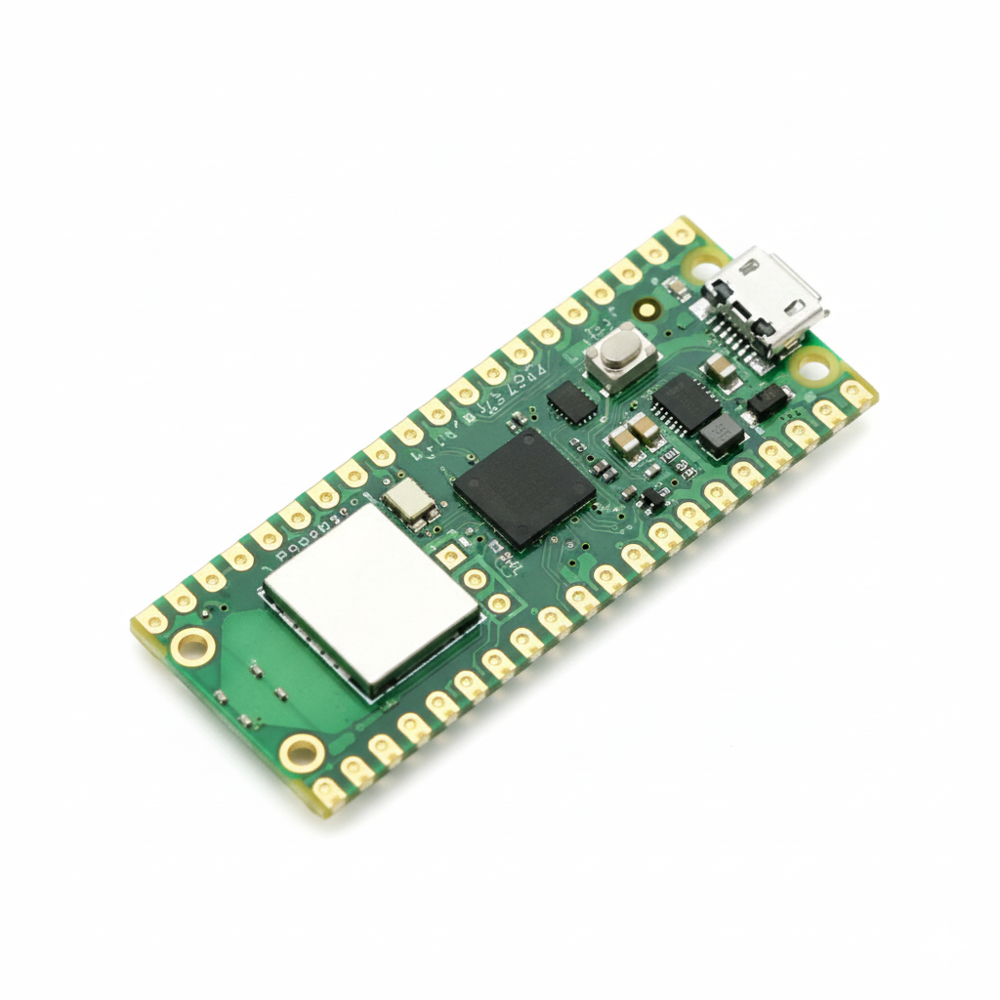
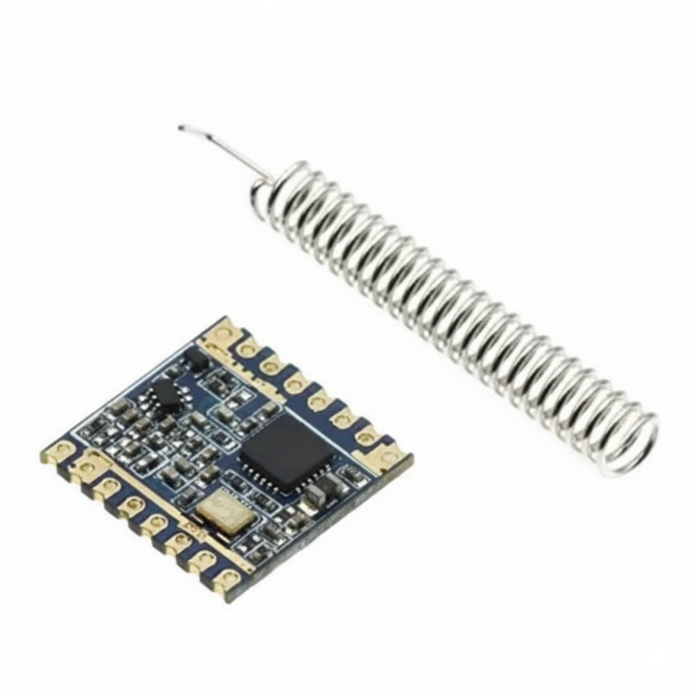
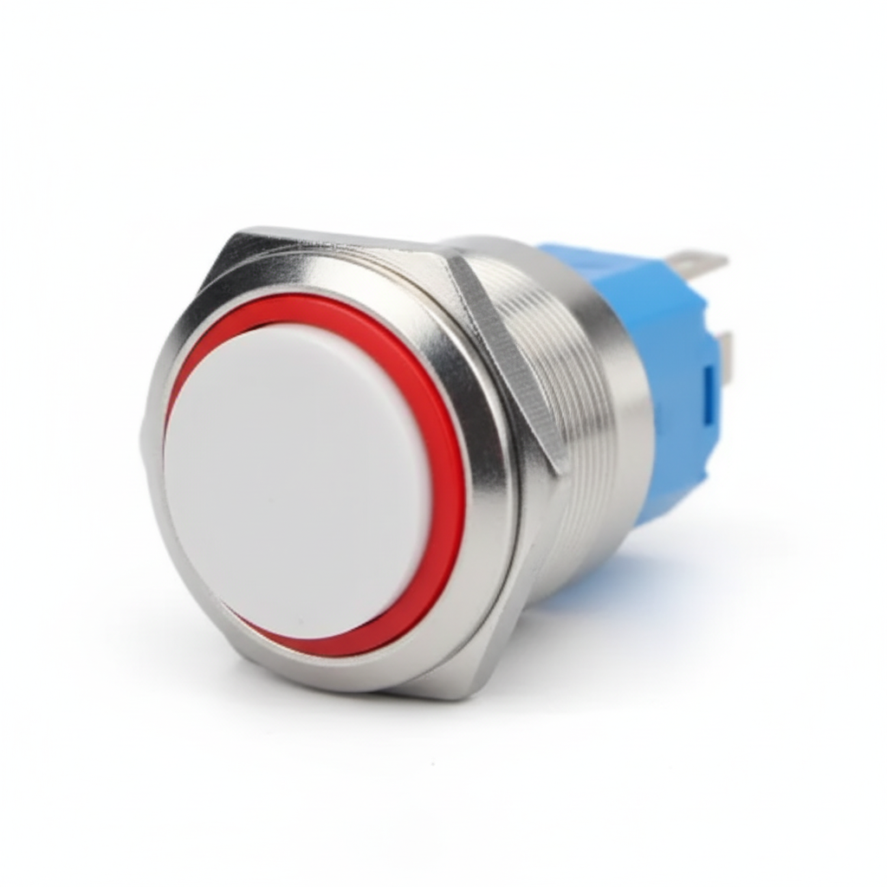
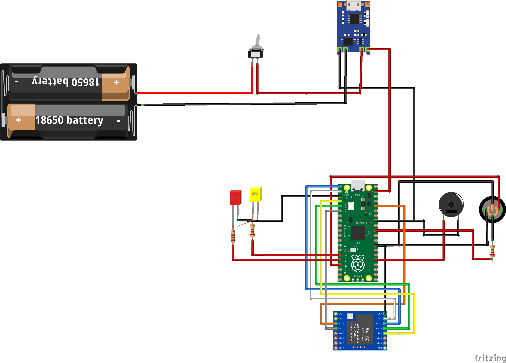
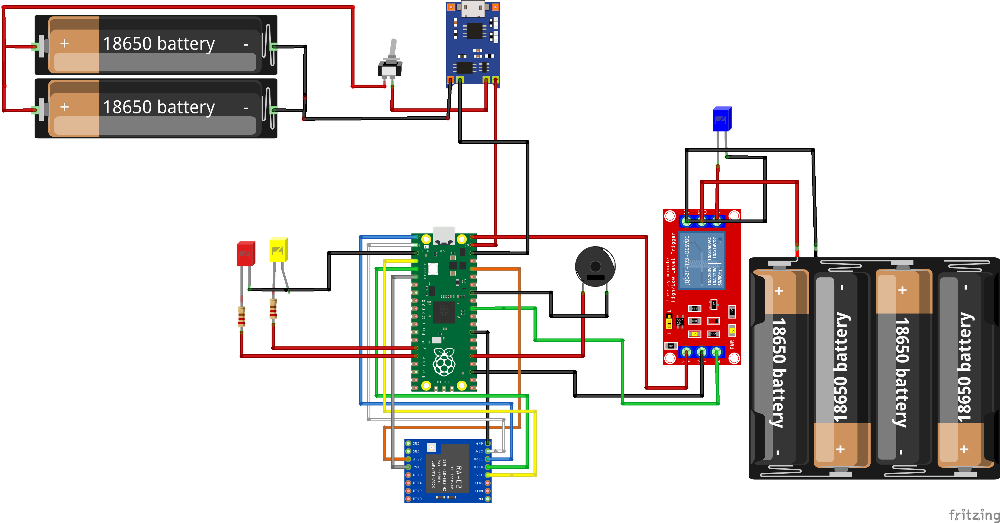

# Hardware - Serra Rocketry Ignitor

## Arquitetura

O sistema possui duas estacoes independentes conectadas por LoRa 433 MHz:

- Estacao de Comando: operada pelo usuario em area segura.
- Estacao de Ignicao: fica proxima ao foguete e aciona o ignitor.

## Lista de Componentes (BOM)

| Item | Qtd | Aplicacao | Observacao |
| --- | --- | --- | --- |
| Raspberry Pi Pico | 1 | Estacao de Comando | MCU RP2040 |
| ESP32-C3 SuperMini | 1 | Estacao de Ignicao | MCU principal de ignicao |
| Modulo LoRa SX1278 433 MHz | 2 | Comando e Ignicao | Um por estacao |
| Antena LoRa 433 MHz | 2 | Comando e Ignicao | Obrigatoria antes de energizar |
| LED amarelo 5 mm | 2 | Status de link | Com resistor |
| LED vermelho 5 mm | 2 | Status de ignicao | Com resistor |
| Buzzer ativo | 2 | Feedback sonoro | Um por estacao |
| Botao de ignicao momentaneo | 1 | Comando | Segurar por 5 s |
| Rele ou MOSFET | 1 | Ignicao | Saida para ignitor |
| TP4056 com protecao | 2 | Carga de bateria | Um por estacao |
| Bateria (Li-ion/LiPo) | 2 | Alimentacao | Definir capacidade |
| Resistores 220 ohms | 4 | LEDs | Dois por estacao |

## Pinagem

### Estacao de Comando - Raspberry Pi Pico

| Pino | Funcao |
| --- | --- |
| GP0 | LoRa MISO |
| GP1 | LoRa CS |
| GP2 | LoRa SCK |
| GP3 | LoRa MOSI |
| GP4 | LoRa RESET |
| GP15 | LoRa DIO0 |
| GP11 | LED amarelo |
| GP12 | LED vermelho |
| GP13 | Botao ignicao |
| GP19 | Buzzer |
| GP25 | LED onboard (link) |

### Estacao de Ignicao - ESP32-C3 SuperMini

Pinagem oficial alinhada ao arquivo `firmware/micropython/estacao_ignicao_esp.py`.

| Pino | Funcao |
| --- | --- |
| GPIO4 | LoRa SCK |
| GPIO6 | LoRa MOSI |
| GPIO5 | LoRa MISO |
| GPIO7 | LoRa CS |
| GPIO3 | LoRa RESET |
| GPIO21 | LoRa DIO0 |
| GPIO20 | LED amarelo |
| GPIO0 | LED vermelho |
| GPIO1 | Buzzer |
| GPIO10 | Rele/MOSFET (ignitor) |
| GPIO8 | LED interno de link |

### Estacao de Ignicao - Raspberry Pi Pico (legado)

| Pino | Funcao |
| --- | --- |
| GP0 | LoRa MISO |
| GP1 | LoRa CS |
| GP2 | LoRa SCK |
| GP3 | LoRa MOSI |
| GP4 | LoRa RESET |
| GP15 | LoRa DIO0 |
| GP11 | LED amarelo |
| GP12 | LED vermelho |
| GP19 | Buzzer |
| GP26 | Rele/MOSFET (ignitor) |
| GP25 | LED onboard (link) |

## Sequencia de Operacao

1. Comando envia `ARM_CONFIRMED` enquanto o botao e mantido.
2. Ignicao confirma com `ACK` e inicia contagem de 5 s.
3. Se houver `ABORT` ou perda de sinal > 500 ms, ciclo e cancelado.
4. Ao final da contagem, saida de ignicao ativa por 2 s.
5. Ignicao envia `IGNITION_COMPLETE`.

## Seguranca

- Sempre conectar antena LoRa antes de energizar.
- Usar botao momentaneo (sem trava).
- Testar com carga dummy antes de ignitor real.
- Manter distancia minima de 10 m em testes operacionais.

## Galeria (Tamanho Padronizado)

Todas as imagens abaixo usam largura padrao de 320 px para manter consistencia visual no documento.

<!-- markdownlint-disable MD033 -->

### Raspberry Pi Pico (Comando)

### Modulo LoRa SX1278

### Botao de Energia

### Botao de Ignicao

### Esquematico - Estacao de Comando

### Esquematico - Estacao de Ignicao

<!-- markdownlint-enable MD033 -->

## Pastas de Hardware

- [3d_models](./3d_models): modelos 3D dos cases.
- [fritzing](./fritzing): arquivos de esquematico/layout.
- [gerbers](./gerbers): arquivos de fabricacao PCB.
- [images](./images): imagens e esquemas.
